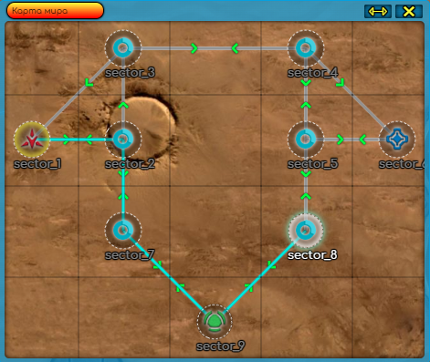

# Veliri
#### браузерная многопользовательская игра в жанре RTS.
Игра повествует о конфликте колонизационных армий за территорию и ресурсы на необитаемой планете.

Опробовать и посмотреть основное описание можно тут (но скорее всего там все лежит С: ):    http://a1c30afd5c6d.sn.mynetname.net

Concept Artist - https://www.artstation.com/tripoltri  
Лор/Тексты заданий - Андрей Бабиченко

#
###### стек искользуемый в проекте:
###### front - HTML/CSS/JS/JQUERY/Phaser2CE/WebSocket
###### back - Golang/Gorilla/PostgreSQl/WebSocket

###### описание структуры бд с коментариями лежит в папке https://github.com/TrashPony/Veliri/tree/master/db_game

#
### ВАЖНО: Код в этом репозитории устаревший т.к. последующая разработка идет в приватном репозитории
#
### Игра делится на 2 основных сервиса и множество мелких

##### База - Место где игроки берут задания, создают/разбирают вещи, торгуют и конфигурируют отряды

##### Глобалка - соотвественно сама игра С:. Игроки на ней перемещаются, воюют, захватывают территории, добывают ресурсы, строят здания поддержки и пр. 

##### Глобальная карта в игре состояит из секторов, перемещение между которыми происходят через специальные ворота (телепорты)

##### У каждого телепорта есть N количество точеку выхода. Если они все заняты то телепорт не работает :)

##### Игрок может управлять на карте до 7ми юнитов одновременно. 1 Это основная мобильная платформа которая может в себе содержать дроны поменьше.

##### Поиск пути реализован на основе алгоритма А*, но немного модифицирован что бы ходить по прямой Х_х
    зеленые квадраты результат поиска пути по алгоритму А*
    синии линии это реальный путь который пройдет юнит

##### На глобальной карте реализована механика тумана войны + радар
    Если обьект видно визуально то игрок получает полную информацию о нем. 
    Если обьект видит только радар то игрок получает информацию о 
    его место положение и типо обьекта, у каждого типа обьекта своя метка.
    [обьект на земле, обьект структура, обьект летает, обьект ресурсы и тд]
    
    Для структур, растений правила немного другие, игрок всегда видит 
    информацию по ним но информарция всегда отдается та которую игрок видил 
    визуально в последний раз. (тоесть игрок может видить обьект на карте а он уже мертв. 
    И он получит обновление информации только когда снова увидит его визуально)
    

##### Строительство - в игре можно строить вспомогательные строения
    К ним относятся:
    -- Радар
    -- Силовой щит (защита от атак)
    -- ПРО (Сбивает приближающиеся ракеты)
    -- Склад (доп. Инвентарь (хранение вещей))
    -- Генератор помех (невидимость для радаров)
    -- Турели (атакуют врагов)
    -- Генератор которые питание другие строения
    
    Строения во время работа потребляют энергию, если ее не хватает
    то строение перестает выполнять свою функцию
    
    Для постройки необходимо иметь модуль строительства, чертеж и ресурсы в трюме
    

##### Стрельба - реализован на основе балистики снарядов
     на текущий момент в игре 5 типов оружия
      -- лазеры - тоже на основе балистики хотя наверно можно было бы и сделать hitscan но это не точно
      -- пушки прямой наводки - выпускает снаряд который летит с заданой скоростью
      -- артилерия - имеет подобие высоты проверяет колизии только когда находится у земли
      -- Ракеты прямой наводской - преследуют цель. Если врезается в обьект то взрывается
      -- Ракеты Арта - взлетают вверх и ускоряются когда нахожятся ближе к цели
      
      Урон может быть как по площади так и только по обьекту колизии

    У кажлого оружия есть точки откуда следует запускать снаряд 
    (на гиф желтые квадратики на другой как работает)

    Так же реализованы методы преследования целей
    

##### Игра жизнь - не имеет практического применения но зато весело Х)
    Создает динамические кусты на карте, мешается при стрельбе, 
    мелкие дроны их немогут пройти хотя Мазешипы уничтожают их при движение.

##### ИИ - игровой интелект ботов, основан на основе графа
    Конфигруерация поведения выглядит примерно вот так, 
    а дальше метод с кучей if
    

##### Фракционная война - в игре можно захватывать сектора
    Правила фракционной войны:
        Когда база или союзный к базе юнит замечает вражеского юнита,
         включается режим осады на 120 сек. И эти 120 секунд всегда обновляются 
         если контакт продолжается. (То есть режим осады спадет если база не 
         видит врага 120 сек)
        
        Через 60 секунд после ПЕРВОГО контакта отключаются телепорты в сектор,
         выйти можно зайти нельзя.
        
        Все нпс охранники направляются в точку контакта что бы дать отпор.
        
        Задача нападающих занять и укрепится вокруг базы в зоне ее влияния 
        (как базу в wot)
        
        Шкала захвата работает так изначально она пуста если база нечейная,
         если база принадлежит кому-то то она заполнена фракцией владельца.
         Каждый вражеский боец в зоне захвата сбивает 1 поинт захвата или
         добавляет 1 поинт захвата если шкала заполняется его фракцией.
          -- Кароче довольно стандартно работает.
        
        Шкала захвата может быть заполнена не полностью это экономика 
         базы в 10% то и шкала будет заполнена на 10% (при начале атаки).
         Если экономика падает до 0% то база автоматически перестает быть
         захваченной.

// TODO добавить картинок

##### Остальное - "github.com/TrashPony/Veliri/src/webSocket/other"

    - Остальное - это сервис который поднят в любом режиме игры. Поэтому он содержит в себе много маленьких сервисов.
        Это чат, обучение, загрузка аватарки, биографии, запросы на характеристики пользователя, прокачка скилов, 
        просмотр карты мира, запоменание положения окон, сервис нотификаций и может что то еще...
        
     
