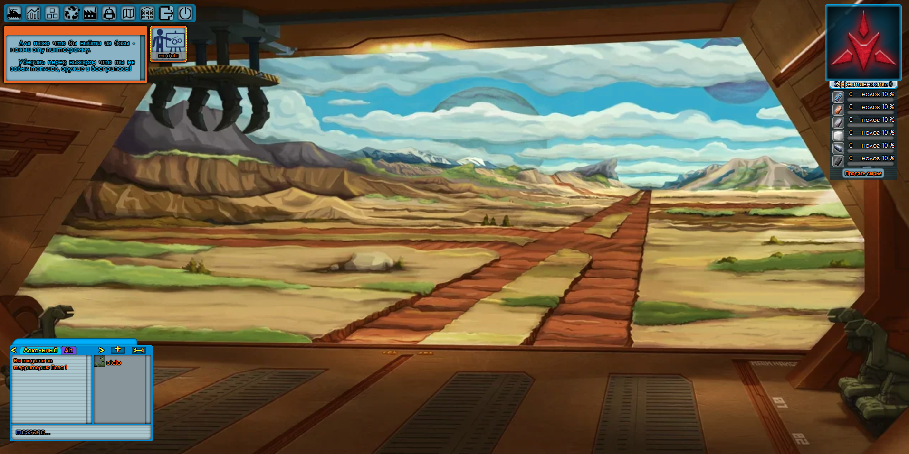
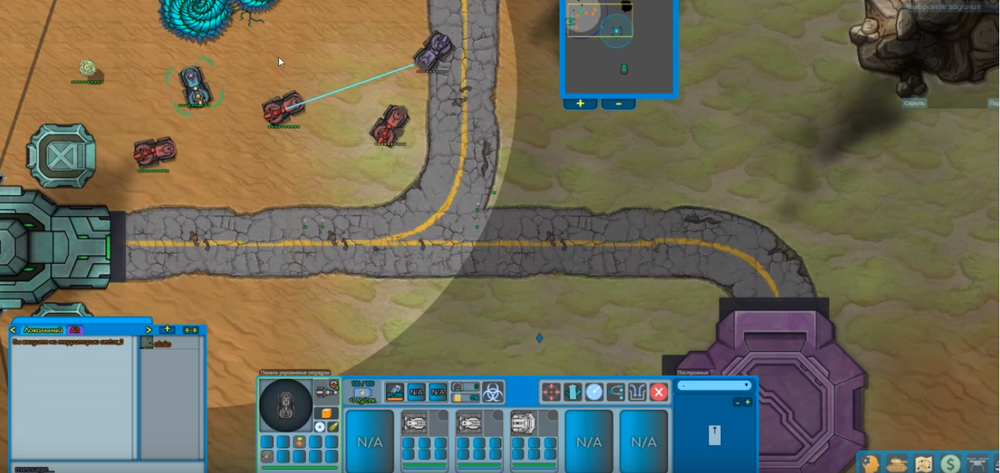
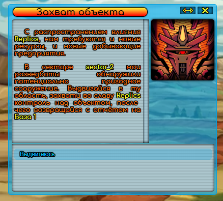

# Veliri
#### демо версия браузерной мморпг с пошаговыми боями.

http://veliri.ru

диздок - https://drive.google.com/file/d/17Fi9x18PkgwWcgjUVZIyVIXbkhoryGCF/view?usp=sharing
(открывается через сервис https://www.draw.io, после регистрации появится в гугл диске открыть с помощью draw.io)

# Описание работы кода. // todo добавить описание фронта)

### описание структуры бд с коментариями лежит в папке https://github.com/TrashPony/Veliri/tree/master/db_game

###### - при поднятие сервера:
    1. первым делом поднмается соедение с базой данных в "https://github.com/TrashPony/Veliri/src/dbConnect"
    2. поднимаются все фабрики из пакета "https://github.com/TrashPony/Veliri/src/mechanics/factories/" 
    эти фабрики содержут в себе все типы обьектов игры, при поднятие забирает все данные типов из бд.
        - так же есть магазин который тоже забирает из бд все сделки находится в пакете 
            "https://github.com/TrashPony/Veliri/src/mechanics/market/"
        - фабрика карт игры не порождает новые экземпляры а выступают как единственный экземпляры каждой игровой карты
    
    3. запускается генератор обьектов на игровых карта картах (подземные аномалии, ресурсы)
    4. запускается модуль который порождает игровых персонажей дальше они продолжают жить своей жизнью, 
    сама реализация ии ботов очень простая (то есть они тупые), живут они сами по себе наличие игрока не обязательно: 
    "github.com/TrashPony/Veliri/src/webSocket/global/ai"
    
        - Аномалии, статичные обьекты который наносят урон всем кто рядом или иной тип воздействия.
        - Облака, тупо отрисовка теней облаков на карте)
        - Обработчики, статичные обьекты которые выступают в роли телепортов в другие секторы, вьезды на базы, точки с 
            которых игроков забирают эвакуаторы (см. ниже)
        - Эвакуаторы, летающие модули которые рандомно перемещаются по карте в пределах низкой гравитации базы, 
            мониторит координаты с обработчиком типа Transport == true. Если игрок задерживается на такой то эвакуатор 
            забирает его на базу. Так же игроки могут сами вызывать эвакуаторы что бы быстрее попасть на базу.
        - MS боты, по сути эти игровые аватары под управление ии, на данный момент они просто перемещаются от базы к 
            базе в разных секторах.
        
    5. так же поднимаются api на вебсокетах для игровых клиентов. 
    
        Все взаимодействие в игре с игровым миром происходит через эти сервисы, и именно от сюда стоит начинать читать код.
        
        - "github.com/TrashPony/Veliri/src/webSocket/lobby" - соеденение отвечающие на дейстельность игроков на базе, 
            тут находится работа верстака и переработчика ресурсов.
        - "github.com/TrashPony/Veliri/src/webSocket/global" - глобальная игровая карта, тут игроки перемещаются, 
            добывают ресурсы, начинают битва и тд.
        - "github.com/TrashPony/Veliri/src/webSocket/field" - локальный пошаговый бой.
        - "github.com/TrashPony/Veliri/src/webSocket/inventory" - работа с инвентарем игрока, так же склады баз и 
            снаряжение отряда.
        - "github.com/TrashPony/Veliri/src/webSocket/market" - магазин.
        - "github.com/TrashPony/Veliri/src/webSocket/other" - отвечает за все мелкие сервисы, просмотр карты с 
            посмтроение маршрута, чат, просмотр статистики игрока, прокачка скилов и тд.
        
### Краткое описание методов.
##### База - "github.com/TrashPony/Veliri/src/webSocket/lobby"

    База - Первое место куда попадает игрок после регистрации. Ему надо выбрать сторону за которую он будет воевать. 
    Так же будет выдано начальное снаряжение. 
        Методы:
            - OutBase - соотвественно выход из базы на глобальную карту.
            - PlaceItemsToProcessor, PlaceItemToProcessor - метод добавление предметов в переработчик ресурсов (
            Processor - инструмент для переработки руд и разбитие игровых обьектов на состовляющие по рецептам).
            - RemoveItemFromProcessor, RemoveItemsFromProcessor - удаление предметов из переработчика.
            - ClearProcessor - удаление ВСЕХ предметов из переработчика.
            - recycle - переработать все предметы находящиеся в переработчике.
            - OpenWorkbench - Говорит что игрок отрыв верстак для создания предметов, отдается все чертежи которые имеются на складе базы
            - SelectBP - в окне верстака игрок выбрал какойто чертеж (blueprint), отдается информация о необходимых предметах для крафта
            - Craft - создание предмета, из инвентаря удаляются все необходимые предметы и создается работа (blueWork)
            - SelectWork - игрок выбрал текущую невыполненую работу, отдается информация о состояние работы, сколько ресурсов 
                было использовано и сколько времение еще необходимо ждать.
            - CancelCraft - отмена создания предмета, игроку отдаются все неизрасходованые ресурсы и отменяет работу.          

        Воркеры (горутины запущенные в отдельном потоке которы что либо проверяют, ожидают, оповещают):
            - WorkerChecker() - просматривает все работы по крафту в игре и когда время крафта истекает, добавляет на 
                склад игрока произведенные предметы и оповещает игрока об этом, обновляет ему инвентарь и склад.
            - BaseStatus() - проверяет эффективность базы, и корректирует налоги под текущую эффективность. 
                Так же оповещает игроков находящехся на базе.

##### Глобалка - "github.com/TrashPony/Veliri/src/webSocket/global"

        Глобальная карта - Место где игроки передвигаются на мазешипах, добывают ресурсы, доставляют предметы с базы на базу,
    воюют друг с другом, ищют аномалии. На глобальной карте доступны меню игрока, рынка, инвентаря (только трюм), просмотр карты мира, 
    снаряжение отряда (только просмотр и заправка снарядами и топливом).
    
        Методы:
            - InitGame - игрок запрашивает всю информацию о мире (в той карте в каторой находится), всех игроков на карте
                их позиции корпуса и пушки, позиции эвакуаторов, облаков, свои характеристики, расположение ресурсов и тд.
                Все игроки тоже получают оповещение что на эту карту пришел новый игрок.
            - MoveTo - метод движения отряда, игрок говорит куда должен ехать мс. Сервер генерит путь до точки назначения или
                до 1го статичного припятвия, и пытается по нему пройти если на пути встречается другой игрок то движение тоже 
                прекращается. Во время движения расходуется топливо, если топлива нет то движение не возможно. Так же во время
                движения проверяется доступность ближайший аномалий, смена гравитации, ящики.
            - StopMove - остановка движения отряда
            - ThrowItems - выкинуть вещи из инвентаря, создается ящик на карте и туда помещаются все выкинутые вещи, 
                ящик имеет бесконечную вместимость но в него нечего нельзя положить и он разрушается если его переехать.
            - openBox - игрок запросил содержимое ящика, если ящик запоролен то игроку будет выведена панель ввода пароля.
            - placeNewBox - разворачивает пустой ящик из инвентаря (имеют размерность но нельзя задавить и можно задать 
                пароль доступа)
            - getItemsFromBox, getItemFromBox - игрок забирает предметы из ящика
            - placeItemToBox, placeItemsToBox - игрок кладет предметы в ящик.
            - boxToBoxItem, boxToBoxItems - игрок перекладывает предметы из 1го ящика в другой
            - evacuation - игрок запросиль эвакуацию на базу, будет выбран свободный эвакуатор и игрок будет доставлен
                если свободного нет то эвакуация не произойдет, надо ждать
            - updateThorium - дозапрвка топливом из инвентаря в топливную ячейку
            - removeThorium - удаление тория из топливной ячеки
            - AfterburnerToggle - вкл/выкл форсажа, скорость передвижения х2, но наносится урон всему отряду случайно, 
                можно умереть.
            - startMining - игрок выбрал снаряжение добычи и навел его на ресурс, начинается добыча ресурса. 
                Снаряжение уход на перезарядку.
            - SelectDigger - игрок выбрал копатель. Отдаются все ячейки где можно копать.
            - useDigger - игрок выбрал ячейку куда будет копать, вылетает копатель. Снаряжение уходит на перезарядку.
            - Attack - игрок нападает на другово игрока, начинается локальная пошаговая битва.

##### Локальный бой - "github.com/TrashPony/Veliri/src/webSocket/field"

    //TODO на данный момент этот модуль не работоспособен. Потому что я его сломал (скрины из старой версии) :С

    Локальный бой - это пошаговая стратегия на hex сетке. 
        Бой делится на 3 фазы.
            - Движения - игроки передвигают своих юнитов. Так же выкатывают из трюма мазершипа мелких дронов. 
                Если игрок выходит за зону боя то он может убежать из боя
            - Действие - игроки наводят своих юнитов на цели говорят им какое снаряжение использовать и назначают 
                кому делать перезарядку орудий. 
            - Бой - сервер просчитывает очередь стрельбы/эквипа по очереди и юниты поочереди делают те действия что 
                были заготовлены на фазе действия.
             
            Во время боя можно заключить перемирие с другими игроками или предложить им содержимое своего трюма.
    (более подробно в диз-доке.)
    
        Методы:
        - InitGame - загрузка локальной игры, отдается игроку все его данные его юниты, его видимые зоны тумана войны,
            информаци о текущей фазе, таймер хода и тд.
            
        движение: 
        - SelectUnit - игрок выбрал юнита в ему вернется снаряжение юнита которое можно использовать или координаты
            движения куда он может пойти.
        - SelectStorageUnit - тоже самое ^ но для юнита который находится в трюме а не на карте.
        - GetPreviewPath - предварительный путь от точки юнита до точки назначения.
        - MoveUnit, PlaceUnit - сервер просчитывает путь и ставит юнита, отправляет его на клиент что бы проиграть анимацию.
        - SkipMoveUnit - пропустить этим юнитом ход.
        
       действие:
        - GetTargetZone - запрос предварительных данных целей на новом месте юнита или просто при наведение на него мыши.
        - Defend - нечего не делать и защищатся, (мини баф на защиту)
        - SelectEquip - игрок выбрал снаряжение юнита.
        - SetTargetUnitEquip - установить цель снаряжения бьющего по карте
        - SetTargetMapEquip -  установить цель снаряжения бьющего по юнитам
        - SelectWeapon - игрок выбрал оружие юнита, вернутся все точки куда можно стрелять. 
                - только балистическое орудие может стрелять куда попало, лазеры и ракеты могут бить только в машины.
        - SetWeaponTarget - установить цель для оружия.
        - InitLeave - игрок вышел за зону боя, если он там простоит до конца боя и его не догонят он может выйти.
        - FleeBattle - соотвественно метод который выводит из боя игрока
        - softFlee - выход из боя если у игрока не осталось врагов, в любое время с сохранение всего.
        - initReload - отдает игроку все боеприпасы который он может поставить в выбраного юнита.
        - Reload - метод который говорит что юнита надо перезарядить. В момент перезарядки он нечего не может делать.
        - OpenDiplomacy - игрок открыл меню дипломатии, отдаются все существующие союзы.
        - ArmisticePact - метод, когда игрок предложил мир другому игроку.
        - AcceptArmisticePact - другой игрок согласился на мир. Если первый предлагал деньги и ресурсы то они ему передались.
        - initBuyOut - игрок предложил мир другому игроку, за вещи из инветаря или деньги (отдается все что игрок может отдать)

        перезарядка (перезаряжатся могут только юниты стоящие в зоне видимости мазершипа): 
        - GetAmmoZone - покажет все координаты где можно перезарядить юнита.
    
##### Инвентарь - "github.com/TrashPony/Veliri/src/webSocket/inventory"

    - Инвентарь - меню где отображается текущее состояние отряда, содержимое его трюма и если игрок на базе, 
        склад текущей базы. Так же если он на базе он может конфигурировать свой отряд, менять отряды, перименовать,
        удалить или починить, а еще... если игрок на базе то поднимается соеденение магазина и из склада можно продавать
        вещи.
        
        
            Методы:
        openInventory - отдается все содержимое инвентаря, отряда и если игрок на базе склада.
        RenameSquad - переименовать отряд
        changeSquad - сменить отряд
        SetMotherShipBody, SetUnitBody - установить другое тело мазершипу или юнита. В случае с мазершипом будет создан 
            новый отряд. Все снаряжение с юнита снимется и будет установленный новый корпус.
        SetMotherShipWeapon, SetUnitWeapon - установить другое оружие юниту, мс.
        SetMotherShipEquip, SetUnitEquip - установить эквип.
        SetMotherShipAmmo, SetUnitAmmo - установить боеприпас оружию.
        RemoveMotherShipBody, RemoveUnitBody - снять тело. В случае с мс удалится весь отряд а все части упадут на склад базы.
        RemoveMotherShipAmmo, RemoveUnitAmmo - снять боезапас
        RemoveMotherShipWeapon, RemoveUnitWeapon - снять пуху.  
        RemoveMotherShipEquip, RemoveUnitEquip - снять эквип.
        itemToStorage, itemsToStorage - перенести айтемы из инвентаря на склад
        itemToInventory, itemsToInventory - из склада в инвентарь
        SetThorium - установить топливо в топливную ячейку МС
        RemoveThorium - удалить топливо из топливной ячеки мс
        InventoryRepair, EquipsRepair, AllRepair - ээээ ремооонт....
        divideItems - разделить ячейку на части (в ячейки 1 было 100 метала, мы сделали 2 ячеки по 50)
        combineItems - обьеденяем ячейки
        changeColor - изменить цвет корпусов или оружия мс и юнита.
        
            Особный метод :)
         UpdateStorage() - вызывается при изменение содержимого склада не по причине игрока, тоесть была произведена вещь
            или купленый вещи на рынке, или выдали по заданию. Метод смотрить если у игрока отрыт инвентарь то он его 
            обновляет на клиенте.
            
##### Магазин - "github.com/TrashPony/Veliri/src/webSocket/market"

    - Магазин - работает по биржевой системе. То есть при выставление оруда на покупку или продажу просматривается рынок
        если есть подходящие сделки по критериям она происходит автоматически.
        
        Методы: 
            openMarket, getMyOrders - запрашивает все ордера на рынке
            placeNewBuyOrder - разместить ордер на покупку. 
            placeNewSellOrder - разместить ордер на продажу.
            cancelOrder - отменить свой ордер.
            buy - купить вещи из уже существующего ордера.
            sell - продать вещи в существующий ордер.
            getItemsInStorage - вовзращает все пердметы которые игрок может продать в ордер.
            
        Особый метод :)
        
        OrderSender() - перед отправкой игрок ордера получают дальность от игрока. Сколько ворот надо пересечь что бы 
            придти на базу где размещет этот ордер.

##### Остальное - "github.com/TrashPony/Veliri/src/webSocket/other"

    - Остальное - это сервис который поднят в любом режиме игры. Поэтому он содержит в себе много маленьких сервисов.
        Это чат, обучение, загрузка аватарки, биографии, запросы на характеристики пользователя, прокачка скилов, 
        просмотр карты мира, запоменание положения окон, сервис нотификаций, а так же модуль ведения диалогов.
        
     